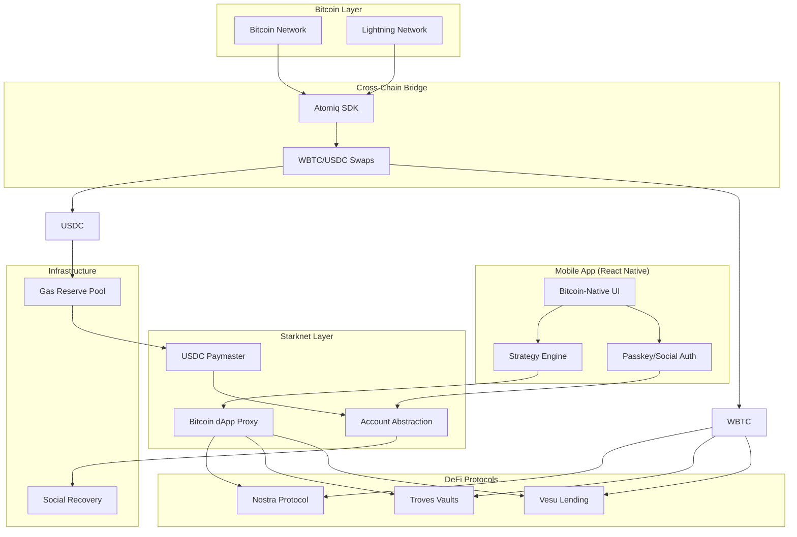
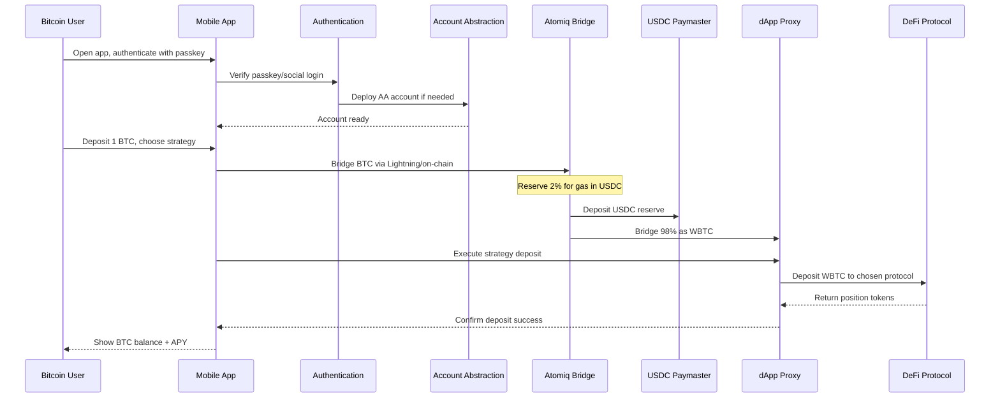

# UnleashBTC ₿

A Bitcoin-first DeFi application that abstracts away Starknet complexity, allowing Bitcoin users to earn yield without managing seed phrases, gas fees, or cross-chain complexity.

## Problem Statement

Starknet dApps require:

- Starknet wallets (ArgentX/Braavos)
- STRK/ETH for gas fees
- Complex cross-chain bridging
- Seed phrase management

**Bitcoin users won't adopt this friction-heavy experience.**

## 💡 Solution

UnleashBTC wraps top Starknet dApps (Vesu, Troves, Nostra) behind a Bitcoin-native interface where:

- Users sign in with passkeys or social login
- All actions funded in BTC
- No seed phrases required
- Gas paid invisibly via reserved USDC balance
- Lightning Network support for instant small payments

## 🏗️ System Architecture



## 🔄 Deposit Flow Sequence



## 🛠️ Technical Implementation

### Key Technologies

- **Account Abstraction**: Starknet.js + ArgentX/Braavos smart accounts
- **Cross-Chain**: Atomiq SDK with built-in Lightning support
- **Gas Abstraction**: AVNU paymaster with USDC reserves
- **Mobile**: React Native with @starknet-react/core
- **Smart Contracts**: Cairo with Scarb and Foundry

### Core Components

#### 1. Account Creation & Recovery

```typescript
// Social login gateway with AA
const credential = await authenticate(preferred_auth); // passkey or social
const account = await deploy_account({
  owner: credential.pubkey,
  guardians: [credential],
});
await setup_recovery(account, [credential, email_backup, phone_backup]);
```

#### 2. Gas Abstraction

```typescript
// Invisible gas fees in USDC
const reserve_usdc = await convert_wbtc_to_usdc(user_wbtc * 0.02);
const paymaster = await setup_paymaster({ token: "USDC" });

const execute = async (operation) => {
  await deduct_usdc(user, estimate_gas_usdc(operation.gas));
  return paymaster.execute(operation);
};
```

#### 3. Cross-Chain Value Transfer

```typescript
// Simplified Atomiq SDK with Lightning
const atomiq = init_atomiq({ network: "mainnet" });

const to_starknet = async (btc_amount, target_token, speed) => {
  if (speed === "instant") {
    return atomiq.lightning_to_starknet(btc_amount, target_token);
  } else {
    return atomiq.bitcoin_to_starknet(btc_amount, target_token);
  }
};

const from_starknet = async (starknet_asset, withdrawal_type) => {
  if (withdrawal_type === "lightning") {
    return atomiq.starknet_to_lightning(starknet_asset);
  } else {
    return atomiq.starknet_to_bitcoin(starknet_asset);
  }
};
```

#### 4. Strategy Engine

```typescript
// Protocol integration with thin Cairo proxy
const deposit = async (btc_amount, strategy, user_preference) => {
  const reserve_usdc = await to_starknet(btc_amount * 0.02, "USDC", "instant");
  const wbtc_amount = await to_starknet(
    btc_amount * 0.98,
    "WBTC",
    user_preference
  );

  if (strategy.type === "lending") {
    return proxy.deposit_to_vesu(wbtc_amount);
  } else {
    return proxy.deposit_to_troves(wbtc_amount);
  }
};
```

#### 5. Smart Contract Orchestration

```cairo
// Minimal proxy contract
#[contract]
mod BitcoinDAppProxy {
    use starknet::{ContractAddress, get_caller_address};

    #[storage]
    struct Storage {
        atomiq_router_address: ContractAddress,
        vesu_pool_address: ContractAddress,
        troves_vault_address: ContractAddress,
    }

    #[external(v0)]
    fn deposit_btc_and_earn(ref self: ContractState, btc_amount: u256, strategy: u8) {
        let wbtc_amount = atomiq_router.swap_btc_to_wbtc(btc_amount);
        if strategy == 1 {
            vesu_pool.deposit(wbtc_amount, get_caller_address());
        } else {
            troves_vault.deposit(wbtc_amount, get_caller_address());
        }
    }
}
```

## User Experience

### Mobile-First Bitcoin Interface

- **Balance Display**: Show BTC balance and APY in Bitcoin terms
- **Actions**: Deposit, Withdraw, Change Strategy
- **Authentication**: Passkey or social login (no seed phrases)
- **Gas**: Invisible USDC payments, shown as BTC equivalents
- **Speed**: Lightning for instant small payments, on-chain for large deposits

### Key Differentiators

1. **Bitcoin-only UX** with zero Starknet cognitive load
2. **Lightning support** via simple SDK calls (no infrastructure setup)
3. **Invisible gas** paid in USDC, shown as BTC equivalents
4. **Mobile-first** with passkey/social recovery
5. **Unified interface** for instant small payments and secure large deposits

## Getting Started

```bash
# Clone the repository
git clone https://github.com/your-org/unleash-btc.git
cd unleash-btc

# Install dependencies
npm install

# Start development server
npm run dev
```

## Mobile App Features

- **Bitcoin-native UI**: All balances and actions in BTC
- **Passkey Authentication**: WebAuthn integration for secure login
- **Strategy Selection**: Choose between lending (Vesu) and vaults (Troves)
- **Real-time APY**: Live yield tracking across protocols
- **Lightning Integration**: Instant deposits and withdrawals

##  Security & Recovery

- **Social Recovery**: Multiple guardians (passkey, email, phone)
- **Account Abstraction**: Smart account management
- **Gas Optimization**: Automatic USDC reserve management
- **Cross-chain Security**: Atomiq's proven bridge infrastructure

## Target Protocols

- **Vesu**: Lending protocol for stable yields
- **Troves**: Vault strategies for optimized returns
- **Nostra**: Additional DeFi protocol integration

## Contributing

We welcome contributions! Please see our [Contributing Guide](CONTRIBUTING.md) for details.

## 📄 License

This project is licensed under the MIT License - see the [LICENSE](LICENSE) file for details.

## 🔗 Links

- **Atomiq SDK**: https://www.npmjs.com/package/@atomiqlabs/sdk
- **Starknet React**: https://github.com/apibara/starknet-react
- **ArgentX**: https://www.argent.xyz/
- **Braavos**: https://braavos.app/

---

_Built with ❤️ @ Starknet Re{solve}_
